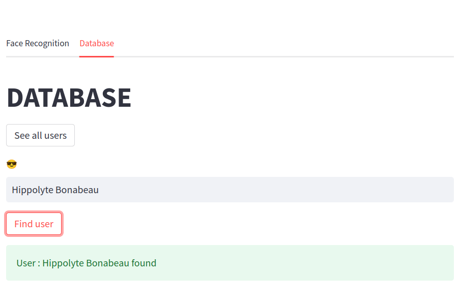

# Face recognition application

Locally hosted face recognition webapp written using streamlit and MongoDB. Locally hosted [here](http://0.0.0.0:8501/).

To build and run: 

```bash
docker compose up --build
```

Stop : 

```bash
docker compose down
```

## User creation


## Access 


## Basic Database





